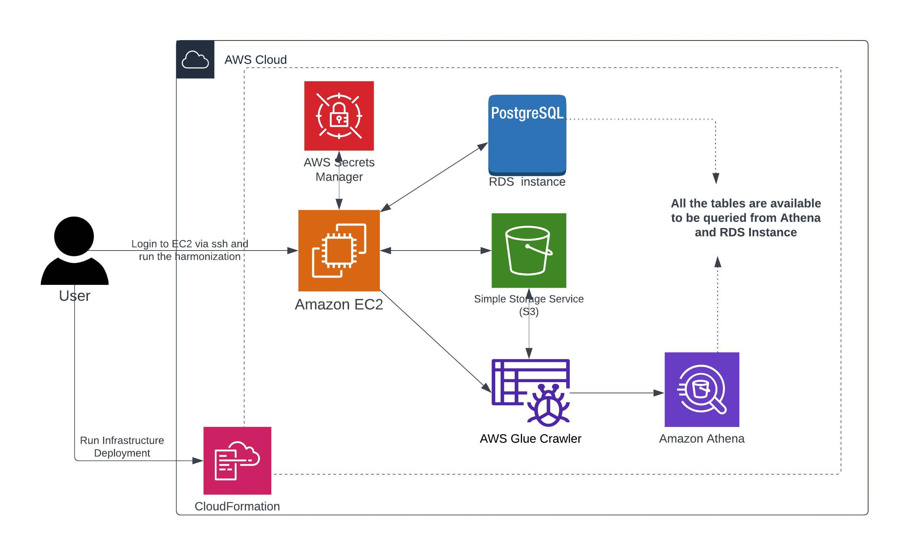
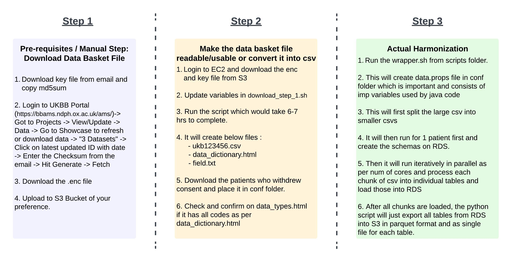

# UKBB Harmonization

This project will consist of code used for harmonizing the UKBB data from data basket downloaded from there Showcase Portal.
This codebase works well with AWS Infrastructure, but can be used with other Cloud Providers with some updates.

The complete harmonization is can be divided into 3 Step process as follows:
- Download the necessary files
- Convert the encrypted file to csv
- Harmonize the csv file into different smaller categories

## Deployment



### Requirements

- Install python3 (aliased as python or else you will have to update deploy.sh)

- Install Node which would be needed for installing aws-cdk for python<br>
    For mac : brew install node<br>
    For windows : https://nodejs.org/en/download

- Install aws-cdk for python<br>
    npm install -g aws-cdk@2.69.0 aws-cdk-lib@2.69.0 

- Install python package constructs<br>
    python -m pip install constructs==10.1.180
    
- Update the variables as per your AWS env in **ukbb-harmonization/configs/deploy_config.env**: 
  - VpcId
  - SubnetIds
  - AvailabilityZones
  - AwsRegion
  - S3BasketBucketName
  - SubnetsCidr
  - EC2KeyPairName
  - DefaultSG

Once the above requirements are fulfilled, run the following command to deploy the infrastructure:
```bash
    export AWS_PROFILE="default" # Needed for cdk to identify which AWS profile to use for fetching details.
    sh deploy.sh prod
```

This will perform steps in following order:
  - Create Postgres RDS Instance and also save the credentials in Secret Manager
  - Create IAM User which will have access to S3 and also RDS Instance. It consists of secret key id and access key id. This is stored in Secret manager and is needed by the       
    harmonization process.
    The harmonization process uses aws_s3 package developed by AWS for loading csv files data directly onto RDS tables. For this process to work, it needs 3 keys: Access Key, Secret Access key and Session Token. Hence, we need a user which will assume role of the EC2 instance and get those 3 things generated to be used further.
  - Create EC2 Instance and get the packages installed, UKBB repo downloaded from github as part of bootstrapping (ukbb-harmonization/cdk_templates/user_data.sh).
  - Bootstrapping will also run maven build of the java code and create the jar which is actually main code for conversion/harmonization.
  - We also create Athena/Glue DB "ukbb_db" (name can be changed from deploy_config.env) and a Glue Crawler which will create Athena tables on top of all the final parquet files.

Now you are all set to run the processes.

## High Level Execution Steps
We follow the steps in below order in order to get the clinical data harmonized.

- Download the .enc and .key files.
- Deploy the infrastructure that includes : Postgres RDS Instance, EC2 Instance, IAM Roles and IAM User for assuming role.
- Login to EC2 instance
- Decrypt and convert the .enc file
- Once, csv file is available, run the wrapper which will perform following:
  - Create schema/tables on RDS
  - Split the .csv into chunks of 1000 patients and depending upon the cores on EC2, run processes in parallel.
  - Load the data into different tables in RDS database
  - Extract all tables in parquet file formats on S3 Bucket specified.

----

## Execution



### Pre-requisites / Manual Step: Download Data Basket File 
    - Download the key file from the email and store it on S3 in your bucket. (ends with .key). This will be needed to decrypt and convert.
    - Keep the checksum/md5sum from email handy.
    - Login to UKBB Portal (https://bbams.ndph.ox.ac.uk/ams/)-> Got to Projects -> View/Update -> Data -> Go to Showcase to refresh or download data -> "3 Datasets" -> Click on latest updated ID with date -> Enter the Checksum from the email -> Hit Generate -> Fetch 
    - Use the wget command manually or download the ".enc" file from browser.

Once these are downloaded, push/upload these files to S3 bucket.

### Step 1 : Make the data basket file readable/usable or convert it into csv

    - Login to EC2 Instance, created as part of deployment.
        ssh -i <Path_to_pem_key> ec2-user@<Private_IP_Address>
        This is the same pem key you provided in deploy_config.env in "EC2KeyPairName" variable.
        You get a message while deploying EC2 stack as well with the command for ssh.

    - Go to : /ukbb-harmonization/clin_db_harmonization/java/ukbb/data/ and download the .enc file and key file from S3.
        Get the S3 Bucket from "S3BasketBucketName" variable from deploy_config.env and run below commands :

        # Create data directoru if not available and copy enc and key file in it.
        mkdir /ukbb-harmonization/clin_db_harmonization/java/ukbb/data
        aws s3 cp <S3BasketBucketName>/<Path_to_key> /ukbb-harmonization/clin_db_harmonization/java/ukbb/data/
        aws s3 cp <S3BasketBucketName>/<Path_to_env> /ukbb-harmonization/clin_db_harmonization/java/ukbb/data/

        Note : This EC2 will only have access to "S3BasketBucketName" , so make sure you copy the key and enc file in that bucket or you explicitly provide access to the other bucket through IAM.
    
    - Go to : /ukbb-harmonization/clin_db_harmonization/scripts

    - Update : download_step_1.sh script with following variables :
      - S3_Path="s3://ukbb-basket-data/" # This is the path where we want to save all files so we dont have to run this process again.
      - WorkDir="/ukbb-harmonization/clin_db_harmonization/java/ukbb/data" # Directory where the key and databasket files are present and will be treated as workdir.
      - Key="k12345r123456.key" # The Key file to decrypt after download from UKBB. Might have to rename with ext .ukbkey instead of .key
      - DataBasketFile="ukb123456.enc" # The .enc file from UKBB Portal.

    - Run : nohup sh -x download_step_1.sh &
        This will take almost 6-7 hours to complete.

    - It will have created following:
      - The input data file i.e. ukb123456.csv. Around 35 GB in size.
      - data_dictionary.html
      - field.txt
    
    - Check if data_dictionary.html and field.txt are copied to : /ukbb-harmonization/clin_db_harmonization/java/ukbb/conf

    - Download the withrawal consent file from UKBB : UKBB Portal -> Projects -> Data -> Showcase -> applications -> Withdrawals tab -> Download file.
        Copy this file as "/ukbb-harmonization/clin_db_harmonization/java/ukbb/conf/ignore_patients.txt"
        These patients will be excluded from harmonization.
    
    - Confirm the data_types.html has codes equal to what is mentioned in last few lines of data_dictionary.html. It should be around 407 but if its more, check which are missing and add those.

### Step 2: Actual harmonization.

    - Go to : /ukbb-harmonization/clin_db_harmonization/scripts

    - Run : sh -x wrapper_harmonization.sh /ukbb-harmonization/clin_db_harmonization/java/ukbb/data/ukb123456.csv

    - This will first update the data.props file. Important file which drives all variables of the process. 
        It is created from data.props_initial_file by replacing variables derived from deploy_config.env and Secret Manager Keys.

    - The Java application (under java/ukbb) is able to take a UK BioBank-formatted CSV file and turn it into a database schema and input data for use in a PostgreSQL-compatible database. 
        The scripts under scripts are responsible for coordinating the parallel loading of a large CSV file into an AWS RDS database instance.

      - load-all.sh takes the full CSV file, splits it up, calls load-schema.sh to prepare the database schema, and then parallelizes load-one.sh over the CSV chunks.

      - load-schema.sh takes a CSV file, splits off the first two lines, and calls the Java app with CREATE_SCHEMA=true enabled to generate the schema data. Then, it loads the schema data into the database.

      - load-one.sh takes a CSV file, calls the Java app, transfers the resulting database CSV files to S3, and then calls the load-sql.sh script to load the data into the database.

      - load-sql.sh takes a file containing SQL statements and sends them to the database.

      - common.sh is not meant to be executed directly; it has shell functions that are common across the various scripts listed above.

    - Once data is loaded in RDS Instance, its time for us to get exports of each table into parquet format.

    - This is done by running : /ukbb-harmonization/clin_db_harmonization/scripts/run_parquet_exports.py . Its part of wrapper itself and will generate corresponding parquet files.

    - Once parquet files are available, it will trigger the Glue crawler and all tables will be available in Athena.

    This step might take around 10-12 hours depending upon the number of patients being loaded.


## Cleanup

Confirm if all the RDS tables are loaded and available in parquet format on S3 and corresponding Glue Tables are queryable.
If yes, now you are good to delete all the 3 stacks from CloudFormation UI (except for Glue Stack) and just use S3 files as you no longer need RDS instance.
This will save you some costs on RDS and EC2 instances.

----
## Contributors

Thanks to these wonderful people for helping in building this tool and open sourcing it :

- Jeffrey Painter (jlpainter | jeff@jivecast.com)
- David Twomey (simoond | david@davidtwomey.com)
- Will Oemler (woemler | willoemler@gmail.com)
- Sarthak Vilas Patel (sarthak1287 | sarthak1287@gmail.com)
- Vesalius Therapeutics (https://vesaliustx.com/)

 
## References
The UKBB utilities checked in at **ukbb-harmonization/clin_db_harmonization/utils** are also available at : https://biobank.ndph.ox.ac.uk/ukb/download.cgi 